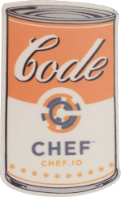

___

## Infrastructure as Code

___

import Tabs from '@theme/Tabs';

import TabItem from '@theme/TabItem';

:::note Notes:

<Tabs
  defaultValue="notes"
  values={[
    {label: 'Expand', value: 'expand'},
    {label: 'Collapse', value: 'collapse'}
  ]}>
  <TabItem value="expand">

  The nice thing about Chef is that it all started with Infrastructure as Code. Because we are codifying the standards of those systems, be it Chef Infra code or Inspec Compliance Language, it should all still be treated with proper development practices.
  
  </TabItem>
</Tabs>

:::
