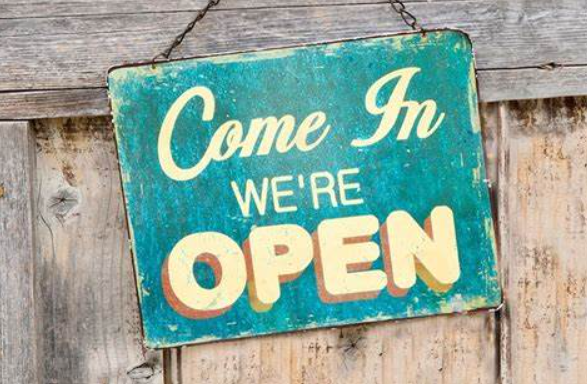

___

## Bring the Community Together

- Hold Office Hours at least once a week.
- Do not have set topics.
- Ask questions too!
- Invite Community to Share Code.
- Reward Community Members for Assisting

## Monthly Learning Events

- Separately hold Month Town Halls.
- Schedule, plan and share.
- Include Metrics.
- Have Community Members Share Wins.

___

import Tabs from '@theme/Tabs';

import TabItem from '@theme/TabItem';

:::note Notes:

<Tabs
  defaultValue="notes"
  values={[
    {label: 'Expand', value: 'expand'},
    {label: 'Collapse', value: 'collapse'}
  ]}>
  <TabItem value="expand">

  Free Verse!

  </TabItem>
</Tabs>

:::

