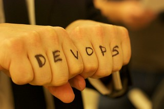

___

## My DevOps Transformation Experiences

### Welcome to the Presentation

***This one is going to be different!***

### Four part Series on my last 5 years of DevOps

- The Saga Begins - From my Aha moment to Building a Team
- The Force Awakens - How we used DevOps to build a Chef Enterprise Solution
- A New Hope - DevOps Transformation / Where you can start
- Rogue One - How Organizations Can Use Chef to Drive DevOps

___

import Tabs from '@theme/Tabs';

import TabItem from '@theme/TabItem';

:::note Notes:

<Tabs
  defaultValue="notes"
  values={[
    {label: 'Expand', value: 'expand'},
    {label: 'Collapse', value: 'collapse'}
  ]}>
  <TabItem value="expand">

## Notes for this Slide
### About this presentation
This presentation is intended to be a four part series on my DevOps Journey focused around the deployment, usage, and socializtion of Chef.

The first part is focused on my backstory, what worked looked like, that time I discovered the DevOps Community, the building of a team to utilize practices and principles that I had discoverd.

</TabItem>
</Tabs>

:::
