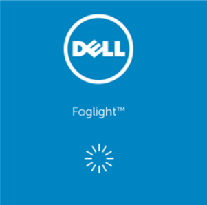

___

## Team Arrangement

- Team was divided into Development, Engineering and Operations.
- Each team supported multiple tools.
- I managed the Operations team.

## Lessons Learned

- Engineering would poorly hand off Operational tasks
- My team didn't have hands on knowledge of building the systems
- Engineers worked on other tools and hard to keep focused on Foglight

## Foglight - The Monitoring Tool

- Was built originally by Quest, Dell bought Quest, Dell spun off Software Division, became Quest again.
- Used for collecting performance and configuration data from VMware vCenters and other hypervisors
- Codified and Customized a lot of reports and built an Auto-Allocation engine to determine where VMs should be provisioned 
- The tool did not scale to our needs, so we had to over-engineer.

___

import Tabs from '@theme/Tabs';

import TabItem from '@theme/TabItem';

:::note Notes:

<Tabs
  defaultValue="notes"
  values={[
    {label: 'Expand', value: 'expand'},
    {label: 'Collapse', value: 'collapse'}
  ]}>
  <TabItem value="expand">

## Moving to Application / Tools Owner

In 2014 I changed roles to support a product called Foglight - a virtual machine monitoring tool originally created by Quest Software and then was sold to Dell when later spun off their software division only to be named Quest again.

We had three separate teams to support all aspects of Foglight. We were broken down into teams by roles which didn't support a single tool but supported multiple tools. Our engineering team was responsible for Proof of Concepts, the Systems and Functional Designs as well as building and deploying the environment. They would create documentation, sometimes useful, then hand it all off to the Operations Team.
In the case of Development, that team did the designs for Dashboards and any customization for data in or out processing as it tied to others. This would often run on the same infrastructure as the tool itself, in Java, which would strain the system due to the amount of data it processed.

One of the very unique things we did with Foglight is built an allocation engine which would gather the data from all of the hosts and determine which had the most capacity available. This would lead to more engineering work to scale with the number of servers and rebuilds and redeploys.
Towards the end of it's life, I requested that my highest level operations folks take over the engineering with the vendor in order to gain the knowledge that was needed to support such a complex environment.

In this lesson of my career there, it was about hand offs and how to support a product exclusively. Having everyone on separate teams really impacted my ability as a product owner. Like the BSA team, we started to employ some Agile processes, creating features and user stories and tracking in CA's Rally Agile product. Again this helped a little, but I still struggled with our Engineering folks in tracking their work. We saw about a 30% improvement, and at the very least the Operations team knew what was going on.

</TabItem>
</Tabs>

:::
