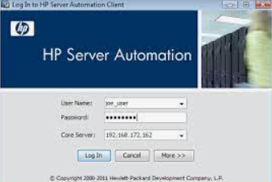

___

## HP Server Automation

- Was our Primary Deployment and Patching Tool
- Used with HP Operations Orchestration for new builds
- Now Called Data Cetner Automation by Microfocus

## The Model

- Applications and OS Patches had to be coded in Java to execute Bash or CMD / PS.
- As system numbers and application teams grew, BSA team didn't.
- Work queued up, using Agile, that only moderately help velocity.

___

import Tabs from '@theme/Tabs';

import TabItem from '@theme/TabItem';

:::note Notes:

<Tabs
  defaultValue="notes"
  values={[
    {label: 'Expand', value: 'expand'},
    {label: 'Collapse', value: 'collapse'}
  ]}>
  <TabItem value="expand">

## What it is

HP Server Automation (now Microfocus Datacenter Automation) was the tool that we used to manage deployments of agents, applications, patches and anything else we needed to get to the servers.
It comprised of an agent and required ports opened back to the HPSA servers. The scripts were written in a combination of bash or Powershell / MS Dos commands wrapped in some Java script.
Even though there was an agent involved it was still a push technology (or atleast the way that we utilized it.)

This combined with HPOO (Operations Orchestration) we were able to build VMs and deploy then execute HPSA jobs to complete the configuration management. This is an early form of what we current can do with Chef or other configuration management tools.

## How we used it

We had an internal team called the BSA (Business Server Automation) team that managed the infrastructure as well as all of the development and deployment of the packages. Server Admins could run SA jobs to complete tasks, and some of us wrote basic deployment packages, but for the most part they were all written by the BSA team of about 8 people.

This single threaded packaging process caused many delays in getting your application packaged and deployed. It required a lot of coordination, building and testing, between the team that needed something deployed and the BSA team. There was a long line of delay and if your application didn't have security needs, it often got bumped down the list for more critical deployments.
The BSA team did employ Agile into their process which helped them a little, but was still far from ideal. What took 9 months now only took 6. 

## The problems of queue worked

As a System Admin, I was often frustrated by the delays in getting items deployed and as I worked with product owners (especially ones requiring agents on servers) I could feel their frustration to. Often we have to manaully push things to servers going around the BSA processes. This meant writing Powershell scripts to connect and deploy.
Later, this will play a big part in my thinking when building a model for working better.

</TabItem>
</Tabs>

:::