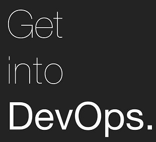

___

## How DevOps Helped Drive Chef

- Building a Team to support the operations of a large Chef environment
- This will consist of:
  - Engineering
  - Operations
  - Development
- We want to practice Agile DevOps

Thus in 2016, my new **DevOps Enablement Services** team was born.
___

import Tabs from '@theme/Tabs';

import TabItem from '@theme/TabItem';

:::note Notes:

<Tabs
  defaultValue="notes"
  values={[
    {label: 'Expand', value: 'expand'},
    {label: 'Collapse', value: 'collapse'}
  ]}>
  <TabItem value="expand">

  ...and so my adventures into Chef begins.

  As I took the role of Product Owner for Chef with the ability to build a team ready to support all of the needs that were forthcoming, it was important to build the team in a "DevOps Model".

  What does that mean to me? Well, we were certainly going to have plenty of Operations tasks - deploying and maintaing the infrastructure as well as the deploying the Chef Client to thousands of servers and making sure they stayed running. This would also require some levels of continous engineering, monitoring best practices, as well as manage the scale we were about to embark upon.

  Initially we were set to deploy and manage about 8000 nodes but knew that once that "Proof of Concept" was going to deliver value, that we would within a year expand to our entire fleet - consisting of at the time about 60 Thousand Nodes.

  I knew that, while we were not initially responsible for the Community of Practice for Chef that we would have to participate and drive as much adoption through leading by example. We would need to participate in some coding efforts as well as possibly extending usability and isolation. This would require a few Devs.
  Let's take a look at how I did that.

  </TabItem>
</Tabs>

:::
