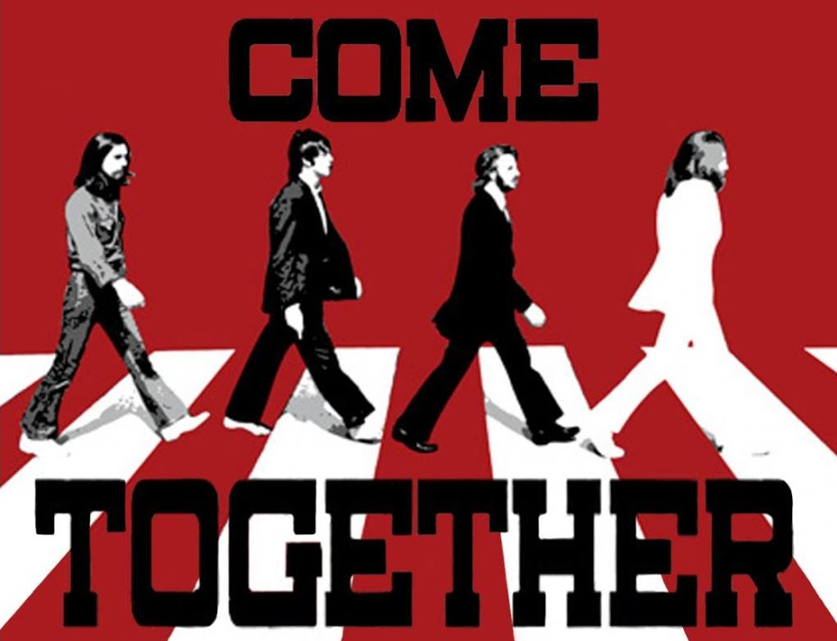

___

## Chef as a Service

- Separate team that focused on adoption
- Started out as a Center of Excellence
- Became a Community of Practice in an effort to Come Together
- Started Weekly Office Hours

## Convergence of Two Teams

- *Chef as a Service* rolled into **DevOps Enablement Services** team.
- Expanded Office Hours to 3 times a week
- Biweekly Infrastructure Base open discussions
- Invited Chef Customer Success Architect
- Many enhancements to offerings came from here!

___

import Tabs from '@theme/Tabs';

import TabItem from '@theme/TabItem';

:::note Notes:

<Tabs
  defaultValue="notes"
  values={[
    {label: 'Expand', value: 'expand'},
    {label: 'Collapse', value: 'collapse'}
  ]}>
  <TabItem value="expand">

  One of the most important things that we did was build a Chef Community on an enterprise wide scale. The beginnings of Chef started with the Chef for DevOps later known as the Chef as a Service team. This is the group that initially worked on the Proof of Concept and started building interest and working with internal customers on training. As the team responsible for the infrastructure and deployment of Chef as a tool, we had a lot of input to what they were selling and it because much more of a partnership.  The Chef as a Service team started with a Center of Excellence that we turned more into a Community of Practice. It is important to distinguish the two and why we settled on a Community of Practice.

  In its most simple form, a Center of Excellence determines the rules that teams must follow to "be excellent" and to obtain assistance. It is a much more rigid approach to solutioning. Where as a Community of Practice implies that we are all here together. We'll discuss this more in our Transformation discussion shortly, but in summary it was important to us, to Me, that we build this product together. Are there rules, well, yes - there has to be, but we'll adjust them as we need. Honestly, that bending of the rules is what our API was for!

  The Chef as a Service team was responsible for training, education, tracking adoption, and helping the customers, as well as the pipeline that moved the cookbooks to our Chef Servers. That latter part was to assure separation of duty so as the infrastructure owners, we couldn't push code through the pipeline to inject code changes. One of the most important parts of their role was actually establishing Office Hours where we would meet once a week to answer any questions our internal customers had, being it code assistance, publishing and pipeline help, or help with the outcomes and nodes checking in or data back for them to better their cookbooks. This was very much a joint venture.

  After a period of time when new customers were engaging, the roles of the Chef as a Service Team were combined with the DevOps Enablement Services team and I took over all of those responsibilities. Our offices hours were really popular so we decided to add a second hour every week and finally a third hour early in the morning for our global operations teams. We also establishing bi-weekly Infrastructure AppStack calls that allowed folks on the patching team, compliance team, OS Standards team and all of the individuals that were responsible for their own agents on the servers to discuss changes and needs. These were also open to all in the organization. The other thing that was crucial to our Office Hours is that it was not just the DevOps Enablement Services team answered questions. WE generally had great participation from folks in other parts of the organization that were using Chef to help answer questions. And lastly, to enhance our office hours, we asked that our customer success architect join us. This really took about 3 years of asking but in the end was really really successful.

  Again, many of the items discussed during Office Hours where there was a problem that needed solving went straight into our backlog, especially around our DoesAPI and Chef Pipeline.

  </TabItem>
</Tabs>

:::
