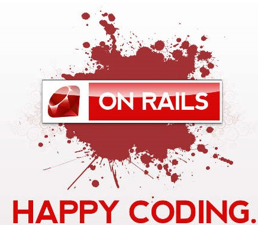

___

## I Dub Thee DoesAPI

- Named after our Team to support all DevOps API initiatives that we provided
- Initially created to be a Notification Forwarder for Chef Client Error Handling
- Created Custom Endpoints for Customers to add Cookbooks
- Created Notification Endpoints for ChatBots
- Anything that was customer connecting requiring access to Chef Infra Server
- Was the API behind our custom Enterprise Service Catalog
- Helped with Self Healing Automation

## Written in Ruby

- We created it in Rails to keep our mindset in Ruby
- Was one of our first Container applications
- Followed Development Best Practices
  - Sourced and issues in GitHub
  - Had a Dev and Prod pipeline
  - Followed more strict Scrum/Agile/Scrumban rules with frequent Grooming
- Supported cross team

___

import Tabs from '@theme/Tabs';

import TabItem from '@theme/TabItem';

:::note Notes:

<Tabs
  defaultValue="notes"
  values={[
    {label: 'Expand', value: 'expand'},
    {label: 'Collapse', value: 'collapse'}
  ]}>
  <TabItem value="expand">

  One of the things that really required us to embrace our Development side of things was a custom API that we called DoesAPI named after our DevOps Enablement Services team.

  </TabItem>
</Tabs>

:::
