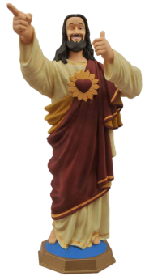

___

## Some of my Guiding Principles or Dogma

### No Handoffs

- **Engineering & Development:** Learn by Doing
- **Documentation:** Run Books, Notes, Engineering designs, Etc.
- **Tasks:** Take control of everything you can!

### Make Work Visible to Everyone

-  **Bring in the good stuff from Agile**
    - Stand ups
    - Retrospectives
		- Post Incident Review

### Communication Makes the Team Work!

- **Chat Ops:** Don't be afraid to ask in public
- **Office Hours:** Can include Lean Coffee, Happy Hours, Water Cooler
	
___

import Tabs from '@theme/Tabs';

import TabItem from '@theme/TabItem';

:::note Notes:

<Tabs
  defaultValue="notes"
  values={[
    {label: 'Expand', value: 'expand'},
    {label: 'Collapse', value: 'collapse'}
  ]}>
  <TabItem value="expand">

  ## Notes for this Slide

  </TabItem>
</Tabs>

:::