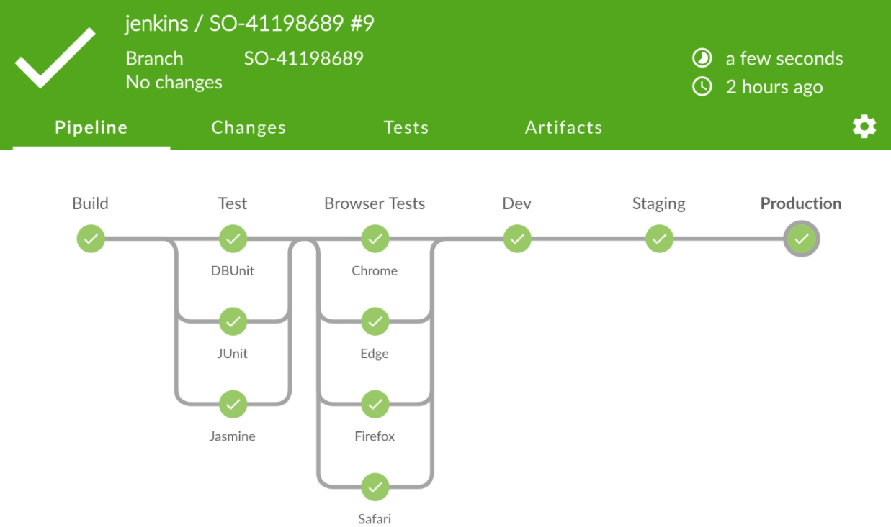

___

## One Last Story

### Chef as a Service Pipeline

- Pipeline was hard coded java in Jenkins.
- It was not easily replicated for each new cookbook.
- It was passed from Chef as a Service and DOES didn't have experience with it.
- There was a huge aging backlog of Enhancements.

### New Chef Pipeline Created

- Jenkins platform it ran on was being sunset.
- Migrating 200 individual pipelines would have been painful.
- Decision was made to start from scratch!
  - Developed a whole new Requirements Doc based off of previous pipeline.
  - We added in the Enhancements on the Backlog
  - We build it using JPAC
  - We used Blue Ocean plugin to make it more customer friendly.

___

import Tabs from '@theme/Tabs';

import TabItem from '@theme/TabItem';

:::note Notes:

<Tabs
  defaultValue="notes"
  values={[
    {label: 'Expand', value: 'expand'},
    {label: 'Collapse', value: 'collapse'}
  ]}>
  <TabItem value="expand">

  So I have one more story for you regarding our implementation of DevOps, how we put it in practice and how it helps with unplanned projects sometimes!

  I'm going to wing it from here, but some day this will be updated.

  Key points to make here:
  
  o We had 2 months notice to get off of our existing Jenkins platform.
  o All of the Github hooks were pointing to that URL.
  o The whole team took a day to put together all of the ideas and create a "Feature" issue in GitHub.
  o We split up the work and started notifying our customers
  o We deployed a whole new working pipeline in less than two weeks
  o Had our customers notified and migrated the active cookbooks in four weeks
  o completed the project ahead of time.
  o Version 2 of the pipeline was actually released 8 weeks later with some major enhancements.

  Why is this story important.

  (1) It utilized all of our best practices.
  (2) Demonstrates that sometimes it is best to just start over again and really isn't as daunting as it may seem.
  (3) It brought us all together as a team.

  Sure, there were planned things those 8 weeks that didn't get done, mostly around client updates or DoesAPI enhancements, but in the end it was totally worth it. Don't be afraid to start from scratch.

  </TabItem>
</Tabs>

:::
