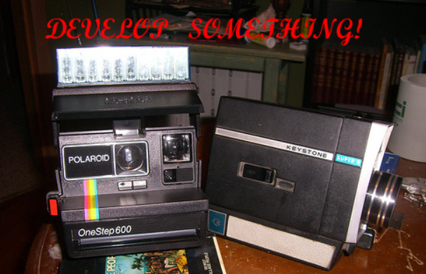

___

## Build a Developers Mindset

- Learn Source Code Management (git)
- Use Developer Tools (VScode)
- Track Work (Kanban)

## Treat Everything As Code

- Start with Chatting
- Log Issues in GitHub with Markdown
- Write your notes in Markdown and Commit and Push
- Create Documentation with Docusaurus or MKDocs

## Infrastructure / Policy as Code

- Bash and Powershell Scripts - Use SCM!
- Try Chef! Code Everything.

___

import Tabs from '@theme/Tabs';

import TabItem from '@theme/TabItem';

:::note Notes:

<Tabs
  defaultValue="notes"
  values={[
    {label: 'Expand', value: 'expand'},
    {label: 'Collapse', value: 'collapse'}
  ]}>
  <TabItem value="expand">

  Free Verse!

  </TabItem>
</Tabs>

:::
