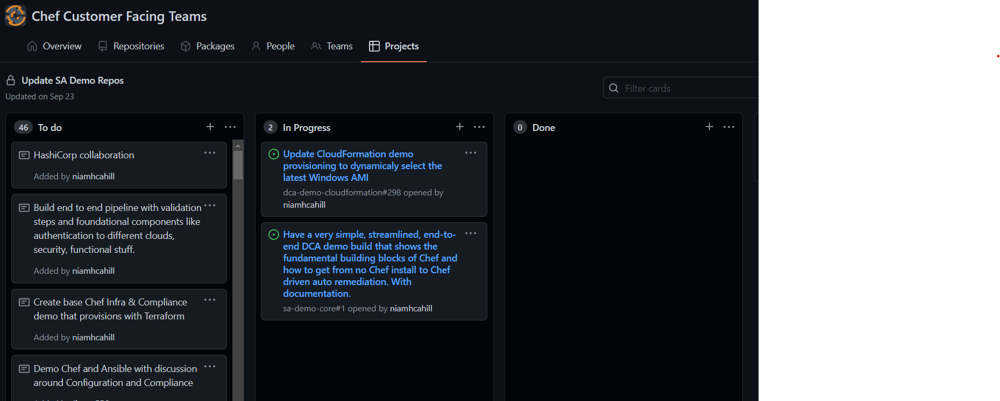

___

## Use Any Tool

- Trello
- CA Agile
- Swift Kanban
- *GitHub*

## Use User Story format for Descriptions

- As the (Stakeholder)
- I want to (Task)
- So that (Outcome)

This actually helps me remember what cards are doing!

Also, I love GitHub because Everything as Code in Markdown!

___

import Tabs from '@theme/Tabs';

import TabItem from '@theme/TabItem';

:::note Notes:

<Tabs
  defaultValue="notes"
  values={[
    {label: 'Expand', value: 'expand'},
    {label: 'Collapse', value: 'collapse'}
  ]}>
  <TabItem value="expand">

  Free Verse!

  </TabItem>
</Tabs>

:::
