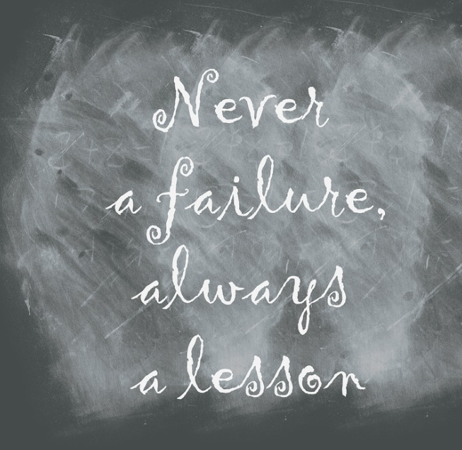

___

## Failure is Always an Option

- Let people fail without repercussion
- Share that failure without blame
- Come together in a supportive manor
- Call them Post Incident Review rather that Post Mortems

## Blameless is the Key

- Identify the Causes without Identifying People
- Make these Public and Share Results
- Again, Practice!

There are plenty of resources online for performing a Blameless Post Incident Review

___

import Tabs from '@theme/Tabs';

import TabItem from '@theme/TabItem';

:::note Notes:

<Tabs
  defaultValue="notes"
  values={[
    {label: 'Expand', value: 'expand'},
    {label: 'Collapse', value: 'collapse'}
  ]}>
  <TabItem value="expand">

  Free Verse!

  </TabItem>
</Tabs>

:::
