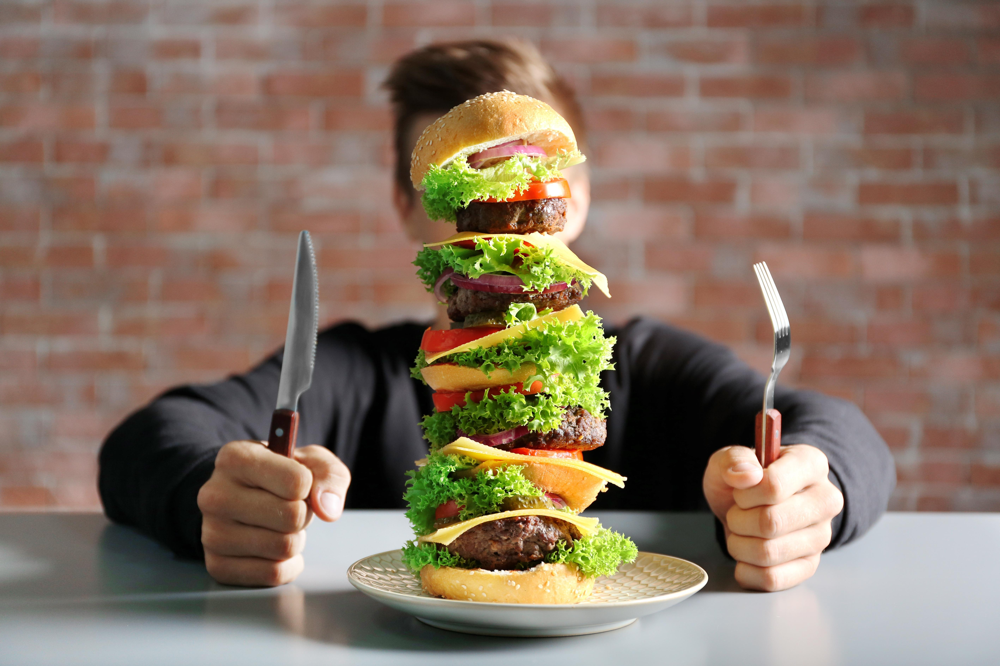

___

## Don't Bite Off More Than You Can Chew

- Pick one or two things to start with.
- Iterate - Keep doing it and making changes.

## It's Called Practice For a Reason

- Be it anything we do, we need to practice.
- These are Practices and they are called that for a reason!

___

import Tabs from '@theme/Tabs';

import TabItem from '@theme/TabItem';

:::note Notes:

<Tabs
  defaultValue="notes"
  values={[
    {label: 'Expand', value: 'expand'},
    {label: 'Collapse', value: 'collapse'}
  ]}>
  <TabItem value="expand">

## Notes for this Slide

  </TabItem>
</Tabs>

:::