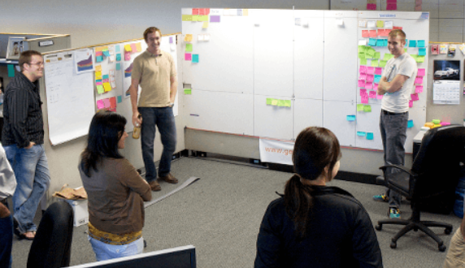

___

## Do It Daily

- Find a time that works for all.
- In Person / On Web Cams / Chat
- Require Participation
- Reference your Kanban / Project Board

## This Takes Time

- Practice Relentlessly
- It Becomes Comfortable
- Provides Transparency
- Will Build the Team

___

import Tabs from '@theme/Tabs';

import TabItem from '@theme/TabItem';

:::note Notes:

<Tabs
  defaultValue="notes"
  values={[
    {label: 'Expand', value: 'expand'},
    {label: 'Collapse', value: 'collapse'}
  ]}>
  <TabItem value="expand">

  Free Verse!

  </TabItem>
</Tabs>

:::
