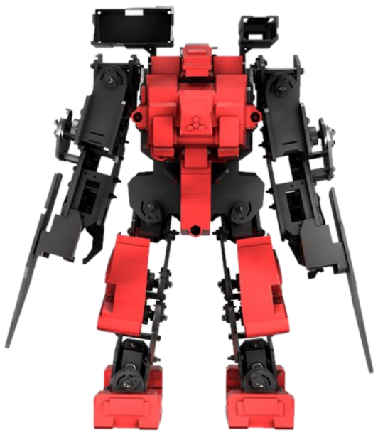

___

### 
___

import Tabs from '@theme/Tabs';

import TabItem from '@theme/TabItem';

:::note Notes:

<Tabs
  defaultValue="notes"
  values={[
    {label: 'Expand', value: 'expand'},
    {label: 'Collapse', value: 'collapse'}
  ]}>
  <TabItem value="expand">

  So, now you are asking "How do I start my own journey?"  It really depends on the side of the house you are on, but as my background is in Operations and that is typically where folks are coming from to start engaging in DevOps especially with Chef or other similar tools, here are some places that you can start.
  
  </TabItem>
</Tabs>

:::
